# Laporan Hands-on 1

## Section 1 - Profil Perangkat Keras Sistem

Berdasarkan hasil identifikasi perangkat keras menggunakan `dmidecode`, `uname -r`, dan `uname -m`, sistem yang diamati berjalan pada lingkungan virtual VMware. Vendor sistem terdeteksi sebagai **VMware, Inc.**, sedangkan nama produk atau modelnya adalah **VMware Virtual Platform**. Identitas tersebut menunjukkan bahwa sistem operasi Linux tidak berjalan secara langsung di atas perangkat keras fisik, melainkan pada perangkat keras virtual yang disediakan oleh hypervisor VMware.

Informasi firmware menunjukkan bahwa BIOS pada mesin ini menggunakan vendor **Phoenix Technologies LTD** dengan versi **6.00** dan tanggal rilis **11/12/2020**. Sistem juga menampilkan **serial number** berupa **VMware-56 4d 73 c4 9e c5 7d 84-aa e5 2b 82 32 ad 38 25**, meskipun pada mesin virtual nilai ini umumnya merupakan identitas virtual yang dihasilkan oleh platform, bukan nomor seri perangkat fisik sebenarnya. Dari sisi sistem operasi, kernel Linux yang sedang digunakan adalah **6.17.0-19-generic**. Arsitektur mesin yang terdeteksi adalah **x86_64**, yang berarti sistem ini menggunakan arsitektur 64-bit berbasis x86.

Untuk komponen motherboard atau baseboard, sistem ini menampilkan **Intel Corporation** sebagai manufacturer dengan nama produk **440BX Desktop Reference Platform**. Informasi tersebut menunjukkan bahwa lingkungan virtual masih mengekspos identitas board yang bersifat generik atau merupakan hasil emulasi platform perangkat keras, sesuatu yang lazim ditemukan pada mesin virtual. Walaupun identitas baseboard dapat dibaca, kombinasi vendor sistem, model produk, dan informasi firmware tetap menunjukkan bahwa mesin ini termasuk **mesin virtual**, bukan mesin fisik. Dengan demikian, profil perangkat keras ini menggambarkan sebuah sistem Linux yang berjalan pada platform virtual VMware dengan firmware virtual, baseboard generik yang diekspos ke guest, serta arsitektur 64-bit modern.

Secara sumber informasi, data vendor sistem, model produk, serial number, baseboard, serta BIOS diperoleh dari tabel firmware melalui `dmidecode`, sedangkan versi kernel dan tipe arsitektur diperoleh dari lingkungan runtime sistem operasi melalui `uname`. Dengan membandingkan kedua kelompok informasi tersebut, dapat disimpulkan bahwa Linux mengenali sistem ini sebagai mesin virtual dengan karakteristik perangkat keras yang sebagian bersifat generik sesuai paparan dari hypervisor.

### Ringkasan Informasi

| Komponen | Informasi |
| --- | --- |
| Vendor sistem | VMware, Inc. |
| Produk/model | VMware Virtual Platform |
| Serial number | VMware-56 4d 73 c4 9e c5 7d 84-aa e5 2b 82 32 ad 38 25 |
| Motherboard/baseboard | Intel Corporation - 440BX Desktop Reference Platform |
| Vendor BIOS | Phoenix Technologies LTD |
| Versi BIOS | 6.00 |
| Tanggal BIOS | 11/12/2020 |
| Versi kernel | 6.17.0-19-generic |
| Tipe arsitektur | x86_64 (64-bit) |
| Klasifikasi mesin | Virtual |

### Bukti Screenshot

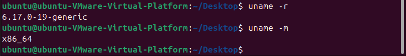

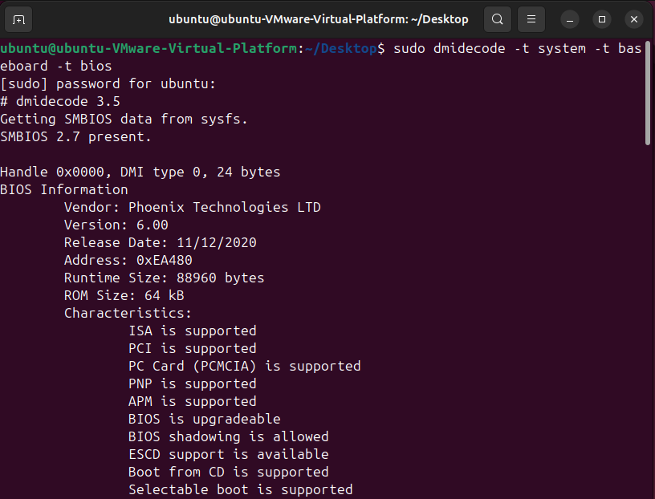

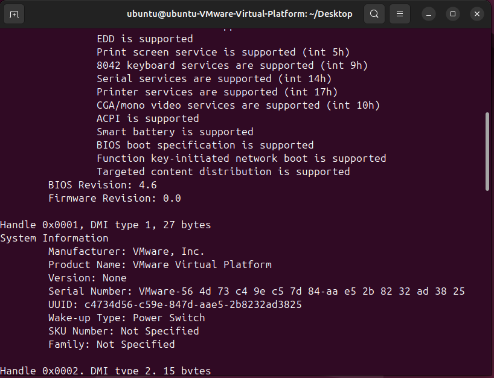

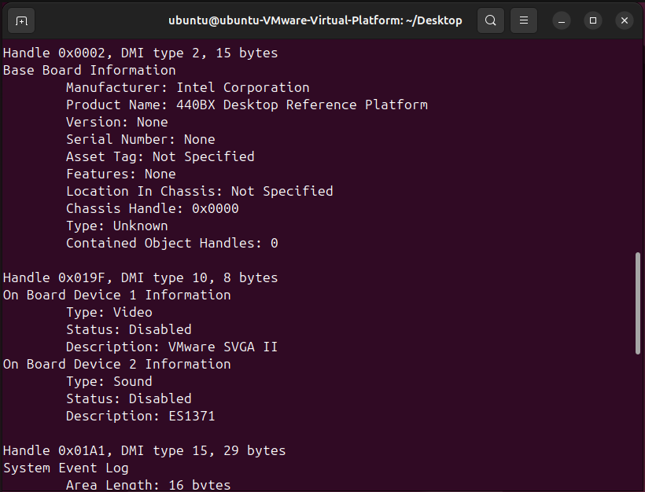

## Section 2 - Topologi CPU dan Arsitektur Pemrosesan

Berdasarkan hasil pengamatan menggunakan `lscpu`, `nproc`, dan `/proc/cpuinfo`, sistem Linux pada mesin virtual ini menggunakan arsitektur **x86_64** dengan **CPU op-mode 32-bit dan 64-bit**. Vendor prosesor yang terdeteksi adalah **GenuineIntel**, dengan model **13th Gen Intel(R) Core(TM) i7-13650HX**. Walaupun sistem berjalan sebagai mesin virtual, Linux tetap dapat melihat topologi CPU yang diekspos oleh hypervisor dan menampilkannya sebagai unit pemrosesan yang dapat dijadwalkan.

Dari output `lscpu`, jumlah **CPU(s)** adalah **2**, dengan konfigurasi **2 socket**, **1 core per socket**, dan **1 thread per core**. Hasil ini sesuai dengan `nproc` dan `grep -c ^processor /proc/cpuinfo`, yang sama-sama menunjukkan nilai **2**. Dengan demikian, verifikasi rumus topologi CPU dapat dituliskan sebagai berikut:

```text
logical CPUs = sockets x cores per socket x threads per core
logical CPUs = 2 x 1 x 1 = 2
```

Perhitungan tersebut sesuai dengan jumlah logical CPU yang dilihat Linux. Hal ini berarti sistem operasi mengenali **dua CPU logis** yang dapat dijadwalkan, yaitu `processor 0` dan `processor 1`. Pada output `/proc/cpuinfo`, masing-masing processor memiliki `cpu cores: 1` dan `siblings: 1`, sehingga dapat disimpulkan bahwa setiap socket virtual hanya mengekspos satu core tanpa simultaneous multithreading atau hyper-threading ke sistem tamu. Dengan kata lain, Linux melihat dua unit eksekusi logis yang berdiri sendiri, bukan satu socket dengan banyak core ataupun satu core dengan banyak thread.

Perbedaan istilah pada topologi CPU dapat dijelaskan sebagai berikut. **Processor** adalah unit CPU logis yang dikenali sistem operasi dan dapat dijadwalkan untuk menjalankan proses atau thread. **Core** adalah inti pemrosesan fisik atau virtual utama yang melakukan eksekusi instruksi. **Thread** adalah jalur eksekusi logis di dalam satu core; bila teknologi SMT atau Hyper-Threading aktif, satu core dapat memiliki lebih dari satu thread. **Socket** adalah paket atau tempat prosesor dipasang dari sudut pandang topologi sistem. Pada mesin virtual ini, hypervisor mengonfigurasi CPU tamu sebagai **2 socket virtual**, masing-masing dengan **1 core** dan **1 thread**, sehingga total logical CPU yang tersedia tetap **2**.

### Ringkasan Topologi CPU

| Komponen | Informasi |
| --- | --- |
| Architecture | x86_64 |
| CPU op-mode | 32-bit, 64-bit |
| Vendor ID | GenuineIntel |
| Model name | 13th Gen Intel(R) Core(TM) i7-13650HX |
| Socket(s) | 2 |
| Core(s) per socket | 1 |
| Thread(s) per core | 1 |
| Logical CPU dari `lscpu` | 2 |
| Logical CPU dari `nproc` | 2 |
| Logical CPU dari `/proc/cpuinfo` | 2 |

### Flags CPU

Flag CPU yang terlihat pada output adalah:

```text
fpu vme de pse tsc msr pae mce cx8 apic sep mtrr pge mca cmov
pat pse36 clflush mmx fxsr sse sse2 ss syscall nx pdpe1gb rdtscp lm constant_tsc
arch_perfmon rep_good nopl xtopology tsc_reliable nonstop_tsc cpuid tsc_known_freq
pni pclmulqdq ssse3 fma cx16 pcid sse4_1 sse4_2 x2apic movbe popcnt aes xsave
avx f16c rdrand hypervisor lahf_lm abm 3dnowprefetch pti ssbd ibrs ibpb stibp
fsgsbase tsc_adjust bmi1 avx2 smep bmi2 erms invpcid rdseed adx smap clflushopt
clwb sha_ni xsaveopt xsavec xgetbv1 xsaves avx_vnni arat umip gfni vaes vpclmulqdq
rdpid movdiri movdir64b fsrm md_clear serialize flush_l1d arch_capabilities
```

### Kesimpulan Section 2

Linux melihat CPU pada mesin virtual ini sebagai **dua logical CPU** yang dapat dijadwalkan. Topologi yang ditampilkan bukan berupa satu socket dengan dua core, melainkan **dua socket virtual**, masing-masing berisi **satu core** dan **satu thread**. Karena itu, hubungan antara socket, core, thread, dan processor dapat diverifikasi dengan jelas, dan hasil pengamatan menunjukkan bahwa konfigurasi CPU virtual yang diekspos oleh VMware konsisten dengan jumlah logical CPU yang terdeteksi oleh sistem operasi.

### Bukti Screenshot

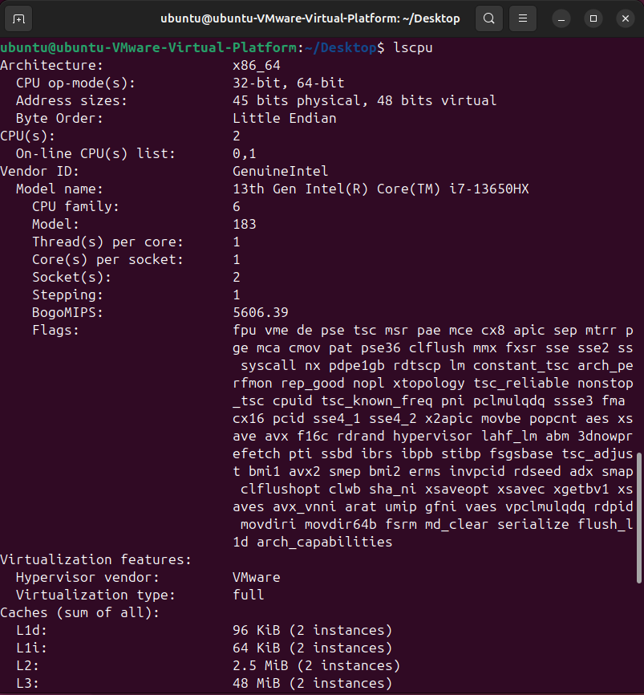

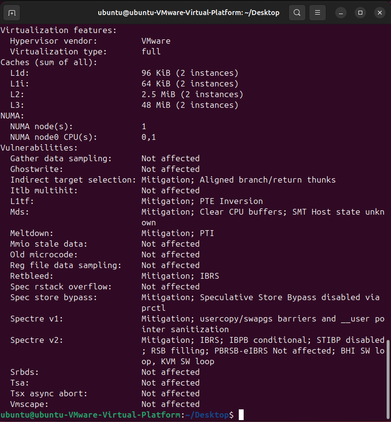

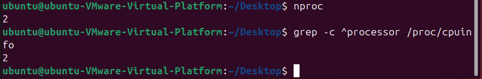

## Section 3 - Flag CPU, Dukungan Virtualisasi, dan Kemampuan Instruksi

Berdasarkan hasil pengamatan terhadap field `flags` dari `lscpu` dan `/proc/cpuinfo`, prosesor virtual yang terlihat oleh Linux memiliki sejumlah kemampuan instruksi penting yang relevan untuk virtualisasi, enkripsi, dan komputasi vektor. Beberapa flag yang dapat diidentifikasi secara jelas dari output adalah `aes`, `sse`, `sse2`, `sse4_1`, `sse4_2`, `avx`, dan `avx2`. Selain itu, terdapat juga flag `hypervisor`, yang menunjukkan bahwa sistem operasi berjalan di dalam lingkungan virtual dan bukan langsung di atas perangkat fisik.

Untuk dukungan virtualisasi perangkat keras, pada output yang tersedia **tidak terlihat flag `vmx` maupun `svm`**. Hal ini tidak selalu berarti prosesor fisik tidak mendukung virtualisasi. Karena sistem berjalan sebagai guest di VMware, sangat mungkin hypervisor **tidak mengekspos** fitur virtualisasi tingkat perangkat keras tersebut ke sistem operasi tamu. Oleh sebab itu, interpretasi yang paling tepat adalah bahwa **dukungan virtualisasi hardware tidak terlihat dari sisi guest**, bukan langsung disimpulkan tidak ada pada prosesor fisik host.

Flag `aes` menunjukkan bahwa prosesor mendukung akselerasi perangkat keras untuk algoritma enkripsi AES. Dukungan ini bermanfaat untuk beban kerja yang melibatkan keamanan data, seperti enkripsi disk, VPN, komunikasi TLS/SSL, dan aplikasi yang sering melakukan operasi kriptografi. Dengan adanya `aes`, proses enkripsi dan dekripsi dapat berjalan lebih efisien dibandingkan jika seluruh operasi dilakukan secara murni oleh perangkat lunak.

Flag `sse`, `sse2`, `sse4_1`, dan `sse4_2` menunjukkan adanya dukungan ekstensi instruksi SIMD generasi SSE. Kemampuan ini bermanfaat untuk pemrosesan data paralel dalam skala kecil, misalnya pada aplikasi multimedia, pengolahan citra, kompresi data, dan beberapa beban komputasi numerik. Di atas itu, keberadaan `avx` dan `avx2` menunjukkan dukungan ekstensi vektor yang lebih modern dengan kemampuan pemrosesan data yang lebih lebar. Fitur tersebut sangat berguna untuk komputasi ilmiah, analisis numerik, machine learning tertentu, multimedia, dan aplikasi yang membutuhkan operasi matriks atau vektor secara intensif.

Dengan demikian, flag CPU yang terlihat pada sistem ini menunjukkan bahwa mesin virtual masih memperoleh akses ke berbagai kemampuan instruksi modern untuk enkripsi dan pemrosesan vektor, tetapi tidak menampilkan flag virtualisasi `vmx` atau `svm` ke guest. Hal ini selaras dengan karakteristik lingkungan virtual, di mana Linux hanya dapat melihat fitur CPU yang benar-benar diteruskan atau diekspos oleh hypervisor.

### Ringkasan Analisis Flag

| Fitur | Flag | Status | Interpretasi |
| --- | --- | --- | --- |
| Virtualisasi Intel | `vmx` | Tidak terlihat | Tidak diekspos ke guest VMware |
| Virtualisasi AMD | `svm` | Tidak terlihat | Tidak relevan pada CPU Intel dan tidak terlihat pada output |
| Enkripsi AES | `aes` | Tersedia | Mendukung akselerasi enkripsi/dekripsi |
| SIMD dasar | `sse`, `sse2` | Tersedia | Mendukung pemrosesan data paralel dasar |
| SIMD lanjutan | `sse4_1`, `sse4_2` | Tersedia | Berguna untuk multimedia, kompresi, dan optimasi instruksi |
| Vektor modern | `avx`, `avx2` | Tersedia | Berguna untuk komputasi ilmiah, numerik, dan multimedia |
| Lingkungan virtual | `hypervisor` | Tersedia | Menunjukkan sistem berjalan di dalam VM |

### Kesimpulan Section 3

Section 3 menunjukkan bahwa Linux dapat mengidentifikasi kemampuan instruksi CPU melalui flag yang diekspos oleh hypervisor. Pada sistem ini, dukungan untuk enkripsi AES serta ekstensi vektor SSE dan AVX tersedia, sehingga guest tetap mampu menjalankan beban kerja modern dengan efisien. Sementara itu, ketiadaan `vmx` atau `svm` pada output menunjukkan bahwa fitur virtualisasi hardware tidak terlihat dari sisi sistem tamu, yang merupakan kondisi umum pada mesin virtual tanpa nested virtualization.

### Bukti Screenshot


## Section 4 - Hirarki Cache CPU dan Hubungannya dengan Kinerja

Berdasarkan hasil pengamatan menggunakan `lscpu`, `lscpu -C`, dan direktori `/sys/devices/system/cpu/cpu0/cache/`, Linux menampilkan hirarki cache CPU dalam tiga level utama, yaitu **L1**, **L2**, dan **L3**. Pada sistem ini, cache level 1 terbagi menjadi dua jenis, yaitu **L1d** untuk data dan **L1i** untuk instruksi. Dari output `lscpu -C`, ukuran **L1d** adalah **48 KiB per instance** dengan total **96 KiB (2 instances)**, sedangkan **L1i** berukuran **32 KiB per instance** dengan total **64 KiB (2 instances)**. Pada level berikutnya, cache **L2** bertipe **Unified** dengan ukuran **1.3 MiB per instance** dan total **2.5 MiB (2 instances)**. Sementara itu, cache **L3** juga bertipe **Unified** dengan ukuran **24 MiB per instance** dan total **48 MiB (2 instances)**.

Pemeriksaan melalui `sysfs` pada CPU 0 memperlihatkan struktur yang konsisten dengan ringkasan tersebut. `index0` menunjukkan cache **Level 1 Data** berukuran **48K**, `index1` menunjukkan cache **Level 1 Instruction** berukuran **32K**, `index2` menunjukkan cache **Level 2 Unified** berukuran **1280K**, dan `index3` menunjukkan cache **Level 3 Unified** berukuran **24576K**. Seluruh cache yang diamati pada CPU 0 memiliki `coherency_line_size` sebesar **64 byte**. Nilai `shared_cpu_list` yang tampil adalah **0** untuk seluruh indeks cache pada CPU 0, yang berarti dari sudut pandang guest Linux, semua cache yang diperiksa pada CPU tersebut tampak terkait dengan CPU 0 saja.

Temuan ini menarik karena secara umum **L1** biasanya bersifat privat per core, **L2** dapat privat atau terbatas penggunaannya, dan **L3** sering kali menjadi cache yang dibagikan di antara beberapa core. Namun pada mesin virtual ini, Linux melihat **dua instance** untuk setiap level cache, dan pada CPU 0 semua level cache tampak tidak dibagikan dengan CPU lain. Hal ini sangat mungkin dipengaruhi oleh cara VMware mengekspos topologi cache ke sistem tamu. Dengan kata lain, struktur cache yang terlihat oleh guest tidak selalu identik dengan struktur cache fisik pada prosesor host.

Secara performa, **L1** dibuat lebih kecil karena harus memiliki latensi akses yang sangat rendah. Cache ini berada paling dekat dengan inti pemrosesan, sehingga cocok untuk data dan instruksi yang paling sering dipakai. **L2** berfungsi sebagai lapisan menengah dengan kapasitas lebih besar tetapi sedikit lebih lambat dibandingkan L1. **L3** memiliki kapasitas paling besar dan berfungsi sebagai penyangga sebelum akses ke memori utama. Pada banyak sistem fisik, L3 dibagikan agar beberapa core dapat memanfaatkan data yang sama dengan efisien. Namun semakin besar ukuran cache, biasanya semakin tinggi pula latensinya. Karena itu, desain cache selalu merupakan kompromi antara kapasitas, kecepatan, dan pola berbagi antar CPU.

### Ringkasan Hirarki Cache

| Level | Tipe | Ukuran per instance | Total | CPU yang berbagi |
| --- | --- | --- | --- | --- |
| L1d | Data | 48 KiB | 96 KiB (2 instances) | Pada CPU 0 terlihat `shared_cpu_list: 0` |
| L1i | Instruction | 32 KiB | 64 KiB (2 instances) | Pada CPU 0 terlihat `shared_cpu_list: 0` |
| L2 | Unified | 1.3 MiB | 2.5 MiB (2 instances) | Pada CPU 0 terlihat `shared_cpu_list: 0` |
| L3 | Unified | 24 MiB | 48 MiB (2 instances) | Pada CPU 0 terlihat `shared_cpu_list: 0` |

### Kesimpulan Section 4

Linux menampilkan hirarki cache yang lengkap untuk mesin virtual ini, mulai dari L1 data, L1 instruksi, L2 unified, hingga L3 unified. Pola yang terlihat menunjukkan bahwa cache menjadi lapisan perantara penting antara register/CPU dan memori utama. L1 berukuran kecil tetapi sangat cepat, sedangkan L3 berukuran jauh lebih besar namun relatif lebih lambat. Pada VM ini, cache yang terlihat oleh guest tampak lebih privat daripada pola umum pada sistem fisik, sehingga hasil observasi juga menunjukkan bahwa topologi cache dalam lingkungan virtual dapat bersifat sintetis atau disederhanakan oleh hypervisor.

### Bukti Screenshot

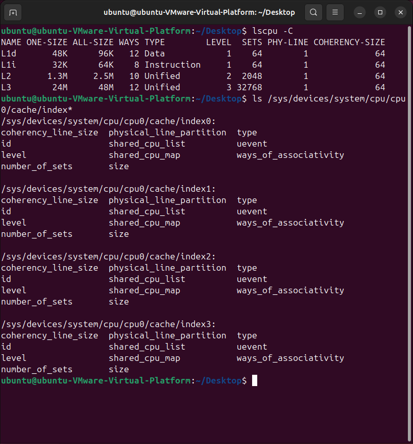

## Section 5 - Perbandingan Memori Fisik dari Firmware dan Memori yang Dilihat Kernel

Berdasarkan output `dmidecode -t memory`, firmware menampilkan satu modul memori yang terpasang dengan ukuran **4 GB** pada **RAM slot #0**. Sementara itu, slot-slot lainnya ditandai sebagai **No Module Installed** atau `[empty]`. Informasi ini menunjukkan bahwa dari sudut pandang firmware, mesin virtual ini dikonfigurasi seolah-olah memiliki satu modul RAM aktif dan banyak slot memori kosong. Kecepatan memori tidak dapat diidentifikasi karena field `Speed` dan `Configured Memory Speed` ditampilkan sebagai **Unknown**, yang merupakan kondisi yang cukup umum pada sistem virtual.

Dari sisi kernel, output `free -h` menunjukkan bahwa total memori yang terlihat saat runtime adalah **3.8 GiB**, dengan penggunaan saat pengamatan sekitar **1.2 GiB**, memori bebas sekitar **1.5 GiB**, serta `buff/cache` sekitar **1.3 GiB**. Nilai `MemTotal` pada `/proc/meminfo` adalah **3960684 kB**, yang secara praktis setara dengan sekitar **3.78 GiB**. Dengan demikian, terdapat selisih kecil antara memori yang terpasang menurut firmware (**4 GB**) dan memori yang benar-benar terlihat oleh kernel (**sekitar 3.8 GiB**).

Perbedaan tersebut merupakan hal yang wajar. Tidak seluruh kapasitas RAM yang terpasang akan selalu muncul sebagai memori yang dapat dipakai langsung oleh kernel. Sebagian kecil memori dapat dicadangkan untuk kebutuhan firmware, metadata perangkat virtual, area pemetaan perangkat keras, kebutuhan hypervisor, atau overhead sistem. Pada lingkungan virtual seperti VMware, selisih ini juga dapat dipengaruhi oleh cara hypervisor mempresentasikan memori ke guest Linux. Oleh karena itu, hasil pengamatan ini menunjukkan bahwa memori yang dilaporkan firmware dan memori yang digunakan kernel memang berkaitan, tetapi tidak selalu identik.

Selain itu, informasi slot memori yang sangat banyak dengan hampir semua slot kosong juga mengindikasikan bahwa data dari firmware pada VM bersifat generik dan tidak sepenuhnya merepresentasikan susunan fisik motherboard nyata. Karena itu, untuk analisis kapasitas memori yang benar-benar tersedia bagi sistem operasi, nilai dari `free` dan `MemTotal` lebih relevan, sedangkan `dmidecode` lebih berguna untuk melihat bagaimana firmware atau hypervisor mendeskripsikan konfigurasi perangkat keras ke sistem tamu.

### Ringkasan Perbandingan Memori

| Komponen | Informasi |
| --- | --- |
| Modul RAM terpasang | 1 modul |
| Ukuran modul | 4 GB |
| Lokasi modul | RAM slot #0 |
| Slot lain | Sebagian besar kosong (`No Module Installed`) |
| Kecepatan RAM | Unknown |
| Total memori menurut firmware | 4 GB |
| Total memori menurut kernel (`free -h`) | 3.8 GiB |
| `MemTotal` dari `/proc/meminfo` | 3960684 kB |

### Kesimpulan Section 5

Perbandingan antara firmware dan kernel menunjukkan bahwa mesin virtual ini dikonfigurasi dengan **4 GB** RAM, tetapi Linux hanya melihat sekitar **3.8 GiB** sebagai memori total yang tersedia saat runtime. Selisih kecil tersebut normal dan dapat dijelaskan oleh reservasi memori untuk firmware, overhead virtualisasi, serta kebutuhan pemetaan sistem. Dengan demikian, Section 5 menegaskan bahwa `dmidecode` menggambarkan inventaris memori yang dipaparkan firmware, sedangkan `free` dan `/proc/meminfo` menunjukkan memori yang benar-benar dikelola dan digunakan oleh kernel Linux.

### Bukti Screenshot

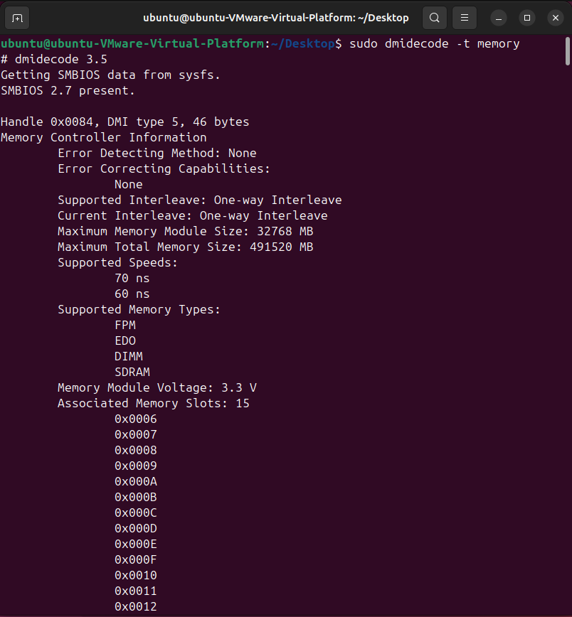

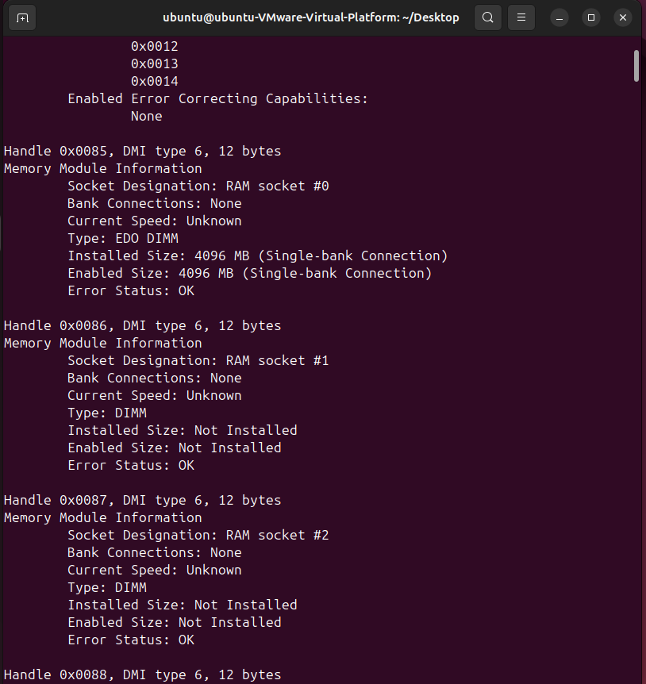

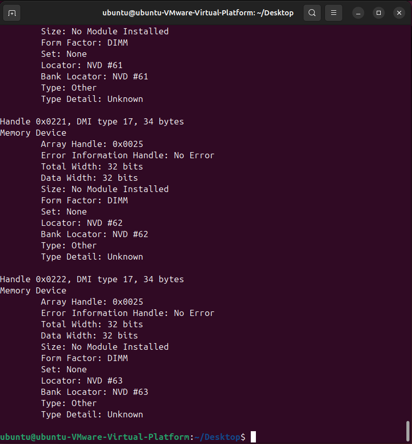

## Section 6 - Interpretasi Penggunaan Memori Linux, Buffer, Cache, dan Available Memory

Berdasarkan output `free -h -w`, sistem memiliki total memori **3.8 GiB**, dengan penggunaan (`used`) sekitar **1.2 GiB**, memori bebas (`free`) sekitar **1.5 GiB**, memori bersama (`shared`) sekitar **32 MiB**, `buffers` sekitar **42 MiB**, `cache` sekitar **1.3 GiB**, dan `available` sekitar **2.5 GiB**. Selain itu, swap berukuran **3.8 GiB** tetapi tidak sedang digunakan sama sekali (`Swap used = 0B`). Data ini menunjukkan bahwa walaupun sebagian RAM tercatat sebagai “used”, sistem masih memiliki ruang memori yang sangat cukup untuk menjalankan beban kerja tambahan.

Dalam interpretasi Linux, nilai **used** tidak boleh langsung dianggap sebagai memori yang benar-benar “habis dipakai” oleh aplikasi. Nilai ini mencakup berbagai penggunaan memori yang masih dapat berubah, termasuk area cache dan struktur kernel tertentu. Nilai **free** menunjukkan RAM yang benar-benar belum dipakai saat itu, tetapi pada Linux angka ini sering lebih kecil karena sistem sengaja memanfaatkan RAM kosong untuk mempercepat akses data. Nilai **shared** menunjukkan memori yang dipakai bersama, misalnya untuk shared memory atau beberapa area yang digunakan oleh lebih dari satu proses. Nilai **buffers** merujuk pada memori untuk metadata I/O dan penyangga sistem, sedangkan **cache** menunjukkan page cache yang dipakai Linux untuk menyimpan data file agar akses ulang menjadi lebih cepat. Yang paling penting untuk menilai kondisi sistem adalah **available**, yaitu perkiraan memori yang masih bisa dipakai aplikasi baru tanpa menimbulkan tekanan memori besar.

Output `vmstat 1 5` memperkuat kesimpulan tersebut. Selama pemantauan, nilai `si` dan `so` bernilai **0**, yang berarti tidak ada aktivitas swap-in maupun swap-out. Nilai `wa` juga **0**, menunjukkan tidak ada waktu tunggu I/O yang signifikan, sedangkan `id` berada pada kisaran **98-99%**, yang menandakan CPU sebagian besar sedang idle. Nilai `r` sangat rendah dan `b` tetap **0**, sehingga tidak terlihat antrean proses atau proses yang tertahan akibat kekurangan sumber daya. Dengan kata lain, sistem tidak sedang mengalami tekanan memori maupun beban kerja berat pada saat pengamatan.

Interpretasi yang benar dari kondisi ini adalah bahwa Linux sedang **memanfaatkan RAM secara efisien**, bukan sedang kehabisan memori. Page cache dan buffer digunakan untuk meningkatkan performa sistem, dan memori tersebut dapat dilepas kembali bila aplikasi membutuhkan. Karena `MemAvailable` tinggi, swap tidak terpakai, dan tidak ada tanda paging aktif pada `vmstat`, maka sistem dapat dinyatakan berada dalam kondisi memori yang sehat.

### Arti Field Penting

| Field | Arti Praktis |
| --- | --- |
| `used` | Memori yang sedang terpakai oleh proses, kernel, dan sebagian area sistem; bukan berarti seluruhnya tidak bisa direbut kembali |
| `free` | Memori yang benar-benar belum dipakai saat itu |
| `shared` | Memori yang digunakan bersama antar proses atau untuk shared memory |
| `buffers` | Memori penyangga untuk metadata dan operasi I/O |
| `cache` | Memori cache file yang dipakai Linux untuk mempercepat akses data |
| `available` | Estimasi memori yang masih dapat dipakai aplikasi baru tanpa tekanan memori besar |

### Ringkasan Kondisi Memori

| Komponen | Nilai |
| --- | --- |
| Total RAM | 3.8 GiB |
| Used | 1.2 GiB |
| Free | 1.5 GiB |
| Shared | 32 MiB |
| Buffers | 42 MiB |
| Cache | 1.3 GiB |
| Available | 2.5 GiB |
| Swap terpakai | 0 B |
| Aktivitas swap (`si`/`so`) | 0 / 0 |

### Kesimpulan Section 6

Sistem tidak sedang berada di bawah tekanan memori. Linux hanya menggunakan RAM secara efisien dengan memanfaatkan buffer dan cache untuk meningkatkan kinerja. Fokus analisis yang benar bukan hanya pada nilai `free`, melainkan terutama pada `available`, aktivitas swap, dan pola `vmstat`. Pada hasil pengamatan ini, seluruh indikator menunjukkan bahwa kondisi memori sistem masih longgar dan sehat.

### Bukti Screenshot

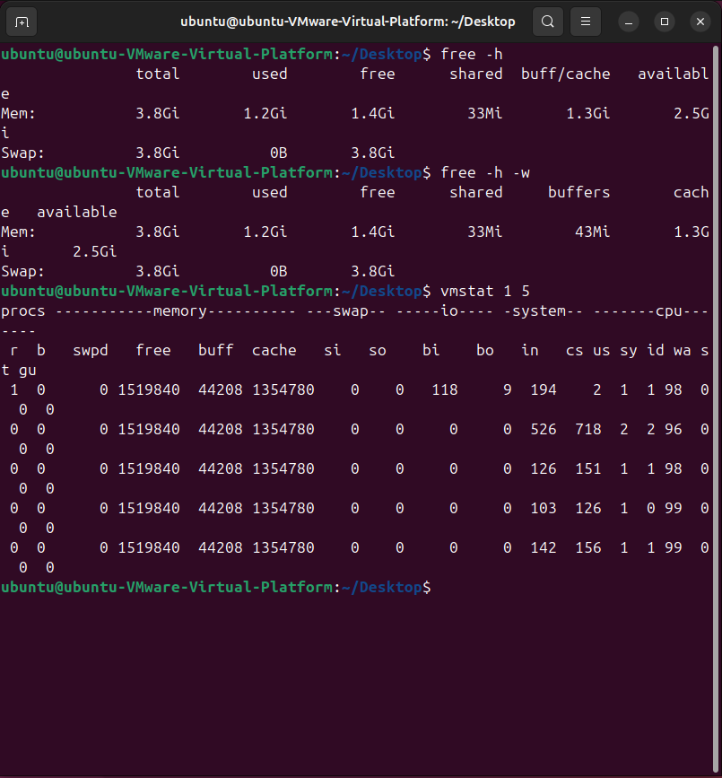

## Section 7 - Pemetaan Perangkat Penyimpanan, Partisi, Filesystem, dan Mount Point

Berdasarkan hasil `lsblk`, sistem menampilkan satu disk utama bernama **`/dev/sda`** dengan kapasitas **25G**. Disk ini memiliki dua partisi, yaitu **`/dev/sda1`** berukuran **1M** dan **`/dev/sda2`** berukuran **25G**. Dari hasil `findmnt /` dan `df -hT /`, root filesystem (`/`) berada pada perangkat **`/dev/sda2`** dengan tipe filesystem **ext4**. Kapasitas filesystem root adalah **25G**, dengan penggunaan sekitar **11G**, ruang tersedia sekitar **14G**, dan tingkat penggunaan sekitar **44%**.

Partisi **`/dev/sda1`** yang sangat kecil kemungkinan berfungsi sebagai partisi sistem kecil atau partisi metadata yang dibentuk saat instalasi, sedangkan **`/dev/sda2`** menjadi partisi utama yang menampung filesystem root Linux. Dalam konteks pengguna, mount point jauh lebih penting daripada nama perangkat mentah, karena seluruh akses terhadap sistem file utama dilakukan melalui direktori **`/`**, bukan dengan berinteraksi langsung ke nama device. Dengan demikian, root filesystem sistem ini dapat dipetakan dengan jelas dari disk fisik virtual ke partisi, lalu ke mount point aktif.

Selain disk utama, output `lsblk` juga menampilkan beberapa perangkat **loop** seperti `loop0`, `loop1`, dan seterusnya. Perangkat-perangkat ini bukan disk fisik terpisah, melainkan image filesystem yang digunakan oleh paket **Snap**, misalnya untuk `core22`, `firefox`, `gnome`, dan komponen sistem lain. Output juga menampilkan **`sr0`** dan **`sr1`** sebagai perangkat `rom`, yang masing-masing dimount ke `/media/ubuntu/CDROM` dan `/media/ubuntu/Ubuntu 24.04.4 LTS amd64`. Kedua perangkat tersebut merepresentasikan media optik virtual atau image ISO yang terpasang di lingkungan VMware.

Dari sudut pandang pemetaan storage, struktur utamanya dapat dijelaskan sebagai berikut: disk virtual utama adalah **`/dev/sda`**, partisi utamanya adalah **`/dev/sda2`**, filesystem yang digunakan adalah **ext4**, dan mount point aktifnya adalah **`/`**. Inilah jalur utama yang menghubungkan perangkat block dengan direktori sistem Linux yang dipakai sehari-hari.

### Ringkasan Storage

| Komponen | Informasi |
| --- | --- |
| Disk utama | `/dev/sda` |
| Kapasitas disk utama | 25G |
| Partisi kecil | `/dev/sda1` (1M) |
| Partisi utama | `/dev/sda2` (25G) |
| Root filesystem device | `/dev/sda2` |
| Tipe filesystem root | ext4 |
| Mount point root | `/` |
| Kapasitas root filesystem | 25G |
| Terpakai | 11G |
| Tersedia | 14G |
| Use% | 44% |

### Storage Map

```text
/dev/sda (25G disk)
|-- /dev/sda1 (1M partisi kecil)
`-- /dev/sda2 (25G, ext4)
    `-- mounted on /
```

### Kesimpulan Section 7

Linux menampilkan struktur storage secara berlapis, mulai dari disk, partisi, filesystem, hingga mount point. Pada sistem ini, perangkat storage utama adalah **`/dev/sda`**, dan root filesystem berada pada **`/dev/sda2`** dengan filesystem **ext4** yang dimount pada **`/`**. Output juga menunjukkan adanya loop device dari Snap dan media optik virtual dari VMware, tetapi jalur penyimpanan utama sistem tetap terpusat pada `/dev/sda2` sebagai tempat Linux dipasang dan dijalankan.

### Bukti Screenshot

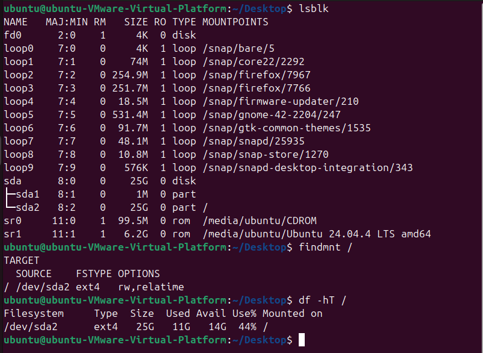

## Section 8 - Inventaris Perangkat PCI dan Keterkaitannya dengan Driver Kernel

Berdasarkan output `lspci -nnk`, Linux berhasil mendeteksi berbagai perangkat internal melalui subsistem PCI. Hasil ini menunjukkan bahwa perangkat keras tidak hanya perlu dikenali berdasarkan identitas vendor dan kelas perangkat, tetapi juga harus dipasangkan dengan driver kernel yang sesuai agar dapat digunakan oleh sistem operasi. Pada mesin virtual VMware ini, beberapa perangkat yang muncul bersifat virtual atau hasil emulasi, tetapi tetap direpresentasikan melalui struktur PCI seperti pada sistem fisik.

Perangkat yang berhasil teridentifikasi antara lain **host bridge**, **PCI bridge**, **ISA bridge**, **IDE interface**, **VGA controller**, **USB controller**, **Ethernet controller**, **multimedia audio controller**, **SATA controller**, serta **VMware Virtual Machine Communication Interface (VMCI)**. Ini menunjukkan bahwa Linux melihat banyak komponen internal sistem melalui bus PCI/PCIe, termasuk komponen yang berkaitan dengan grafis, jaringan, audio, storage, dan komunikasi antarmesin virtual.

Beberapa perangkat utama yang dapat diklasifikasikan dari output adalah sebagai berikut. **VGA/GPU** terdeteksi sebagai **VMware SVGA II Adapter**. **Ethernet controller** terdeteksi sebagai **Intel Corporation 82545EM Gigabit Ethernet Controller (Copper)** dengan driver kernel aktif **`e1000`**. **Audio device** terdeteksi sebagai **Ensoniq ES1371/ES1373 / Creative Labs CT2518** dengan driver **`snd_ens1371`**. **USB controller** muncul sebagai **VMware USB1.1 UHCI Controller** dengan driver **`uhci_hcd`** dan **VMware USB2 EHCI Controller** dengan driver **`ehci-pci`**. Untuk storage, **SATA controller** terdeteksi sebagai **VMware SATA AHCI controller** dengan driver **`ahci`**, sedangkan **IDE interface** terdeteksi sebagai **Intel 82371AB/EB/MB PIIX4 IDE** dengan driver **`ata_piix`**. Selain itu, antarmuka khusus virtualisasi juga muncul sebagai **VMware Virtual Machine Communication Interface** dengan driver **`vmw_vmci`**.

Salah satu contoh keterkaitan perangkat dengan driver kernel dapat dilihat pada kartu jaringan virtual. Perangkat **Intel 82545EM Gigabit Ethernet Controller** dikenali oleh Linux sebagai **Ethernet controller**, kemudian diikat ke driver kernel **`e1000`**. Informasi ini penting karena deteksi perangkat saja belum cukup; Linux juga harus memuat driver yang benar agar perangkat dapat digunakan untuk komunikasi jaringan. Dengan kata lain, `lspci` menunjukkan identitas perangkat, sedangkan `lspci -k` memperlihatkan hubungan perangkat tersebut dengan driver dan modul kernel yang aktif.

### Ringkasan Perangkat PCI

| Kelas Perangkat | Nama Perangkat | Driver Kernel |
| --- | --- | --- |
| Host bridge | Intel 440BX/ZX/DX - 82443BX/ZX/DX Host bridge | `agpgart-intel` |
| IDE interface | Intel 82371AB/EB/MB PIIX4 IDE | `ata_piix` |
| VMware communication | VMware Virtual Machine Communication Interface | `vmw_vmci` |
| VGA/GPU | VMware SVGA II Adapter | Tidak terlihat pada potongan output |
| USB controller | VMware USB1.1 UHCI Controller | `uhci_hcd` |
| Ethernet controller | Intel 82545EM Gigabit Ethernet Controller | `e1000` |
| Audio controller | Ensoniq ES1371/ES1373 / Creative Labs CT2518 | `snd_ens1371` |
| USB controller | VMware USB2 EHCI Controller | `ehci-pci` |
| SATA controller | VMware SATA AHCI controller | `ahci` |

### Kesimpulan Section 8

Section 8 menunjukkan bahwa Linux mendeteksi banyak perangkat internal melalui subsistem PCI dan kemudian mengaitkannya dengan driver kernel yang sesuai. Pada mesin virtual ini, inventaris PCI mencakup perangkat grafis, jaringan, audio, USB, storage, dan perangkat virtualisasi VMware. Hal ini menegaskan bahwa manajemen perangkat keras di Linux bukan hanya soal mengenali perangkat, tetapi juga memastikan adanya driver aktif yang memungkinkan perangkat tersebut berfungsi di dalam sistem operasi.

### Bukti Screenshot

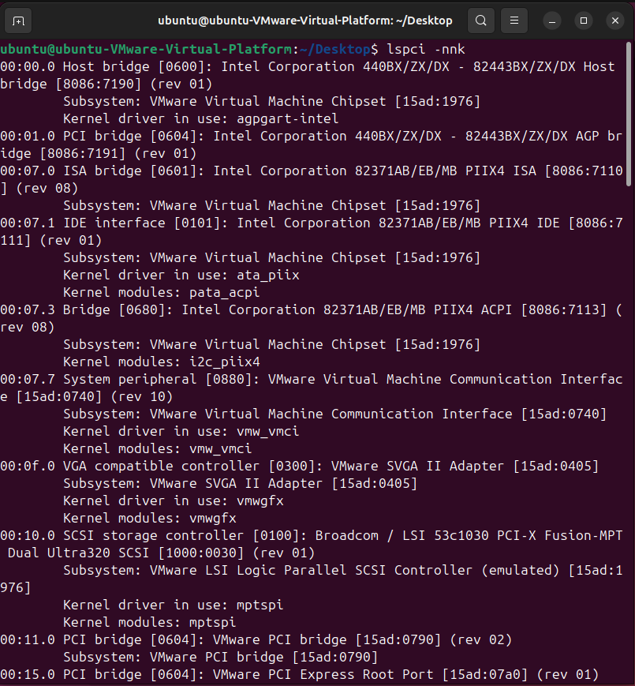

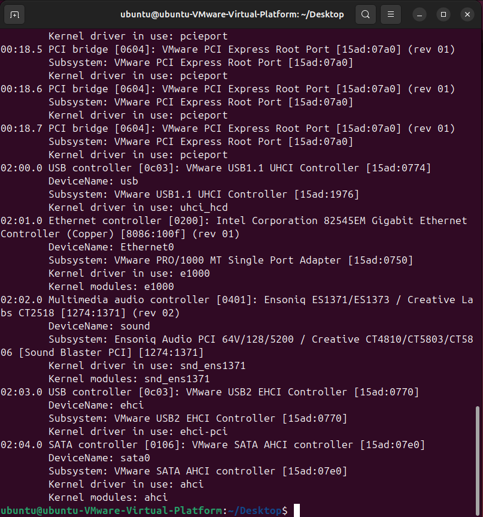

## Section 9 - Perangkat Jaringan dan Karakteristik Link

Berdasarkan hasil identifikasi interface jaringan dan detail perangkat keras, sistem memiliki satu antarmuka Ethernet aktif dengan nama **`ens33`**. Dari output `lshw -class network`, perangkat ini dikenali sebagai **Intel 82545EM Gigabit Ethernet Controller (Copper)** dengan vendor **Intel Corporation**. Nama logis yang digunakan Linux untuk perangkat ini adalah **`ens33`**, sedangkan alamat MAC yang terdeteksi adalah **`00:0c:29:ad:38:25`**. Output konfigurasi juga menunjukkan bahwa interface ini sedang aktif dan memiliki alamat IP **`192.168.5.128`** pada saat pengamatan.

Dari sisi karakteristik link, output `ethtool` menunjukkan bahwa interface `ens33` mendukung mode link **10 Mbps**, **100 Mbps**, dan **1000 Mbps**, dengan dukungan auto-negotiation aktif. Kondisi link saat pengamatan adalah **Link detected: yes**, kecepatan efektif **1000 Mb/s**, mode **Full Duplex**, dan tipe port **Twisted Pair**. Hal ini menunjukkan bahwa antarmuka jaringan virtual berhasil beroperasi pada link gigabit penuh, yang cukup umum pada lingkungan virtual VMware ketika perangkat virtual Ethernet berhasil terhubung normal ke jaringan host atau virtual switch.

Untuk sisi driver, output `ethtool -i` menunjukkan bahwa interface ini menggunakan driver kernel **`e1000`** dengan `bus-info` **`0000:02:01.0`**. Informasi ini konsisten dengan output `lspci -nnk` pada Section 8, di mana perangkat PCI **Intel 82545EM Gigabit Ethernet Controller** juga terikat pada driver **`e1000`**. Dengan demikian, perangkat jaringan yang terlihat pada level PCI dan antarmuka jaringan yang terlihat pada level sistem operasi sebenarnya merujuk pada perangkat yang sama, hanya ditampilkan melalui dua lapisan abstraksi yang berbeda.

Perbedaan antara kedua tampilan tersebut penting untuk dipahami. Tampilan **PCI** berfokus pada identitas perangkat keras, vendor, kelas perangkat, dan driver kernel yang mengikat perangkat. Sementara itu, tampilan **interface jaringan** melalui `ip`, `ethtool`, atau `lshw` menekankan sisi operasional perangkat, seperti nama interface, alamat MAC, IP address, kecepatan link, status koneksi, dan parameter duplex. Dengan menggabungkan keduanya, administrator dapat memahami bahwa satu NIC yang sama dapat dilihat baik sebagai perangkat PCI pada bus tertentu maupun sebagai interface jaringan yang dipakai sistem untuk komunikasi.

### Ringkasan Interface Jaringan

| Komponen | Informasi |
| --- | --- |
| Nama interface | `ens33` |
| Jenis perangkat | Ethernet |
| Produk | Intel 82545EM Gigabit Ethernet Controller (Copper) |
| Vendor | Intel Corporation |
| MAC address | `00:0c:29:ad:38:25` |
| IP address | `192.168.5.128` |
| Driver kernel | `e1000` |
| Bus info | `0000:02:01.0` |
| Link detected | Yes |
| Speed | `1000 Mb/s` |
| Duplex | Full |
| Port type | Twisted Pair |
| Auto-negotiation | On |

### Kesimpulan Section 9

Section 9 menunjukkan bahwa perangkat jaringan di Linux harus dipahami dari dua sisi sekaligus, yaitu sebagai perangkat keras pada bus PCI dan sebagai interface logis pada level sistem operasi. Pada sistem ini, NIC **Intel 82545EM** muncul sebagai perangkat PCI di **`0000:02:01.0`**, menggunakan driver **`e1000`**, dan di level OS direpresentasikan sebagai interface **`ens33`**. Link jaringan terdeteksi aktif dengan kecepatan **1 Gbit/s** dan mode **full duplex**, sehingga dapat disimpulkan bahwa antarmuka jaringan virtual ini terkonfigurasi dengan baik dan berfungsi normal.

### Bukti Screenshot

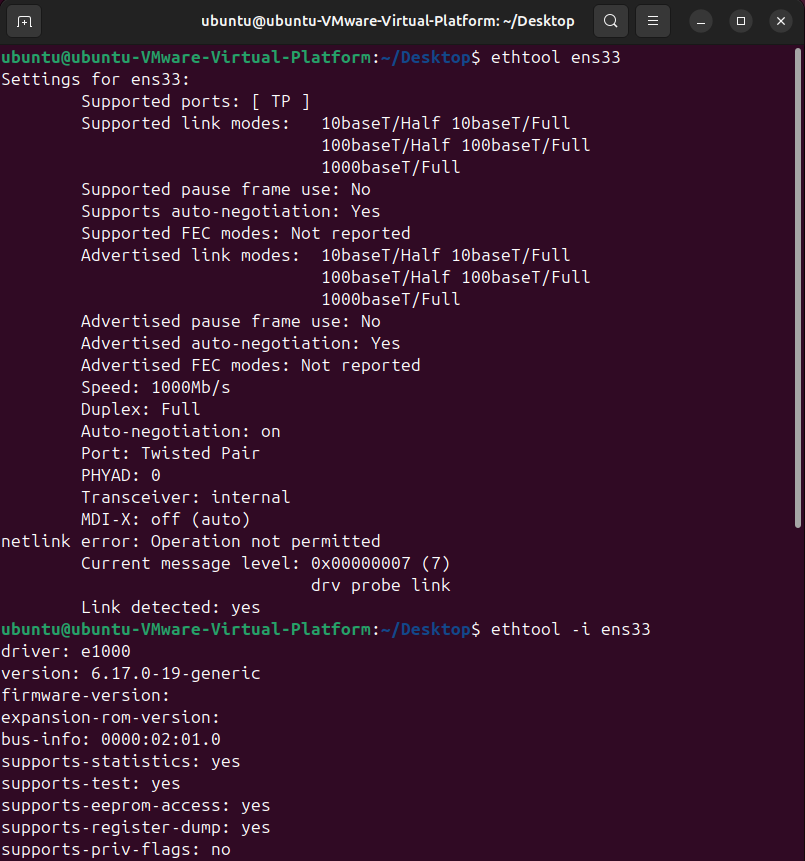

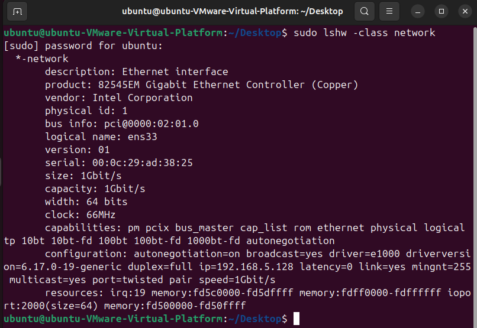

## Section 10 - NUMA, Lokalitas CPU, dan Penempatan Resource

Berdasarkan output `lscpu`, sistem menampilkan informasi NUMA berupa **`NUMA node(s): 1`** dan **`NUMA node0 CPU(s): 0,1`**. Hal ini menunjukkan bahwa Linux hanya melihat **satu node NUMA** yang mencakup seluruh logical CPU yang tersedia pada mesin virtual ini. Dengan kata lain, dari sudut pandang guest Linux, topologi memori dan CPU tampak **seragam** dan tidak terbagi ke dalam beberapa node dengan jarak akses yang berbeda-beda. Karena itu, sistem ini lebih tepat digolongkan sebagai **UMA-like** daripada sistem NUMA kompleks.

Karena hanya ada satu node NUMA, CPU **0** dan **1** sama-sama berada pada **node 0**. Untuk ukuran memori per node, tidak ada pemisahan antarnode yang terlihat pada data yang tersedia. Oleh karena sistem hanya mengekspos satu node, maka secara praktis seluruh memori guest yang terlihat Linux, yaitu sekitar **3.8 GiB**, dapat dipahami sebagai memori yang berada pada **node 0**. Ini merupakan interpretasi yang wajar pada mesin virtual kecil, di mana hypervisor menyederhanakan topologi sehingga akses memori tampak seragam untuk semua CPU yang tersedia.

Lokalitas tetap penting untuk dipahami, meskipun pada sistem ini tidak terlihat kompleksitas NUMA yang nyata. Pada sistem **database**, lokalitas memori memengaruhi kecepatan akses data, terutama ketika thread pemrosesan dan memori kerja berada pada node yang sama. Pada lingkungan **virtualisasi**, penempatan vCPU dan memori tamu yang selaras dengan node fisik host dapat mengurangi latensi dan meningkatkan stabilitas performa. Untuk aplikasi **multi-thread**, lokalitas penting karena thread yang sering berbagi data akan bekerja lebih efisien jika berjalan pada CPU yang dekat dengan cache dan memori yang relevan. Pada sistem NUMA besar, akses ke memori lokal biasanya lebih cepat daripada akses ke memori node lain, sehingga penempatan resource yang buruk dapat menurunkan performa.

Pada mesin virtual ini, karena Linux hanya melihat satu node NUMA, sistem tidak perlu melakukan optimasi penempatan beban kerja berdasarkan node yang berbeda. Artinya, akses memori dari sudut pandang guest cenderung tampak merata. Walaupun demikian, memahami konsep NUMA tetap penting karena pada server fisik atau sistem multiprocessor besar, Linux dapat menjadwalkan workload pada topologi yang memiliki biaya akses memori yang tidak seragam.

### Ringkasan NUMA

| Komponen | Informasi |
| --- | --- |
| Jumlah node NUMA | 1 |
| CPU pada node 0 | `0,1` |
| Memori per node | Secara praktis seluruh memori guest berada pada node 0 |
| Karakter sistem | Lebih mirip UMA |

### Kesimpulan Section 10

Section 10 menunjukkan bahwa sistem ini tidak menampilkan topologi NUMA yang kompleks. Linux hanya melihat satu node NUMA yang mencakup seluruh CPU dan memori guest, sehingga sistem tampak **UMA-like**. Meskipun tidak ada pembagian memori antar node pada pengamatan ini, konsep lokalitas tetap penting untuk dipahami karena pada database, virtualisasi, dan aplikasi multi-thread, penempatan CPU dan memori yang tepat dapat sangat memengaruhi kinerja pada sistem yang benar-benar NUMA-aware.

### Bukti Screenshot


## Section 11 - Menghubungkan Pesan Boot Kernel dengan Hardware yang Terdeteksi

Berdasarkan potongan output `dmesg`, kernel Linux menampilkan jejak yang jelas tentang proses deteksi perangkat keras pada fase awal boot. Log yang terlihat terutama berfokus pada pembacaan informasi firmware, deteksi awal CPU, pemetaan memori, serta interpretasi tabel ACPI yang disediakan oleh VMware. Ini menunjukkan bahwa deteksi hardware di Linux bukan hanya daftar perangkat statis, melainkan proses bertahap yang terjadi sejak kernel mulai dijalankan.

Salah satu pesan penting yang muncul adalah **`KERNEL supported cpus:`**, yang menandai tahap awal inisialisasi arsitektur CPU. Pada fase ini kernel memeriksa dukungan platform prosesor yang dapat dijalankan oleh kernel tersebut. Pesan ini merepresentasikan tahap **CPU initialization**, yaitu saat kernel mulai menyiapkan fondasi eksekusi untuk prosesor yang tersedia.

Pesan berikutnya yang penting adalah **`DMI: Memory slots populated: 1/128`**. Pesan ini menunjukkan bahwa kernel membaca informasi inventaris perangkat keras dari tabel DMI/SMBIOS yang diberikan firmware atau hypervisor. Dari sini kernel mengetahui bahwa hanya **1 slot memori** yang dianggap terisi dari total **128 slot** yang dipaparkan secara virtual. Pesan ini berkaitan dengan tahap **memory detection**, karena Linux sedang membangun gambaran awal tentang konfigurasi memori yang tersedia dari sisi firmware.

Kelompok pesan seperti **`ACPI: RSDP`**, **`ACPI: XSDT`**, **`ACPI: FACP`**, **`ACPI: APIC`**, **`ACPI: SRAT`**, dan **`ACPI: HPET`** menunjukkan bahwa kernel sedang membaca tabel ACPI yang menjelaskan struktur perangkat keras dan konfigurasi platform. Setelah itu, muncul pula pesan seperti **`ACPI: Reserving ... table memory at [mem ...]`**, yang menandakan bahwa kernel mencadangkan area memori tertentu agar tabel firmware tersebut tidak ditimpa selama proses boot. Ini merepresentasikan tahap **firmware table parsing and memory reservation**, yaitu saat kernel mengintegrasikan informasi firmware ke dalam peta memori sistem.

Pesan **`ACPI: SRAT: Node 0 PXM 0 [mem ...]`** dan **`Early memory node ranges`** juga penting karena menunjukkan bagaimana kernel memetakan memori ke node sistem pada tahap awal. Hal ini berkaitan langsung dengan analisis NUMA pada Section 10, di mana sistem guest hanya terlihat memiliki satu node. Selain itu, banyaknya pesan **`ACPI: LAPIC_NMI (acpi_id[...]) high edge lint[0x1]`** menunjukkan tahap konfigurasi **interrupt controller** dan penyiapan Local APIC/NMI untuk CPU, yang merupakan bagian penting dari inisialisasi perangkat keras prosesor dan mekanisme interrupt.

Dengan demikian, tiga contoh pesan hardware yang dapat dipilih dari log ini adalah:

| Pesan | Tahap Inisialisasi yang Diwakili |
| --- | --- |
| `KERNEL supported cpus:` | Inisialisasi awal CPU dan validasi platform prosesor |
| `DMI: Memory slots populated: 1/128` | Deteksi inventaris memori dari firmware/DMI |
| `ACPI: Reserving ... table memory` | Reservasi area memori untuk tabel firmware ACPI |

Log yang Anda kirim lebih banyak menyorot fase **early boot** daripada fase pemuatan driver perangkat seperti NIC atau storage controller. Namun justru ini sangat berguna untuk menunjukkan bahwa sebelum Linux memuat driver seperti `e1000` atau `ahci`, kernel terlebih dahulu harus memahami tabel firmware, peta memori, dan topologi interrupt yang diberikan oleh platform virtual. Dengan kata lain, `dmesg` memperlihatkan urutan kronologis bagaimana hardware dikenali dan disiapkan sebelum sistem masuk ke tahap operasional penuh.

### Kesimpulan Section 11

Section 11 menunjukkan bahwa `dmesg` merupakan jejak kronologis proses inisialisasi hardware oleh kernel Linux. Pada log yang diamati, tahapan yang paling jelas terlihat adalah inisialisasi CPU, pembacaan tabel ACPI, deteksi konfigurasi memori dari DMI, dan reservasi area memori firmware. Walaupun potongan log ini belum banyak menampilkan tahap pemuatan driver perangkat seperti NIC atau storage, data yang ada sudah cukup untuk membuktikan bahwa Linux mendeteksi hardware secara aktif dan bertahap sejak fase awal boot.

### Bukti Screenshot

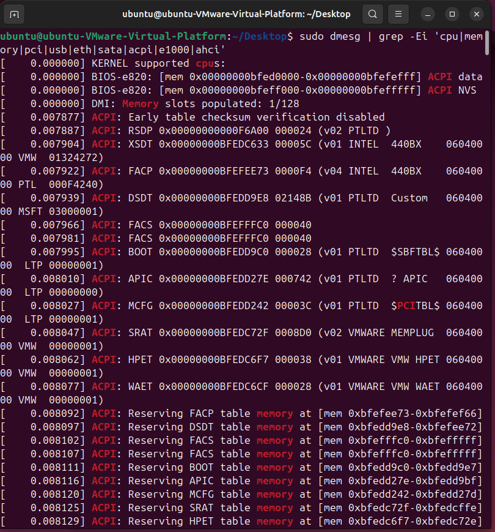

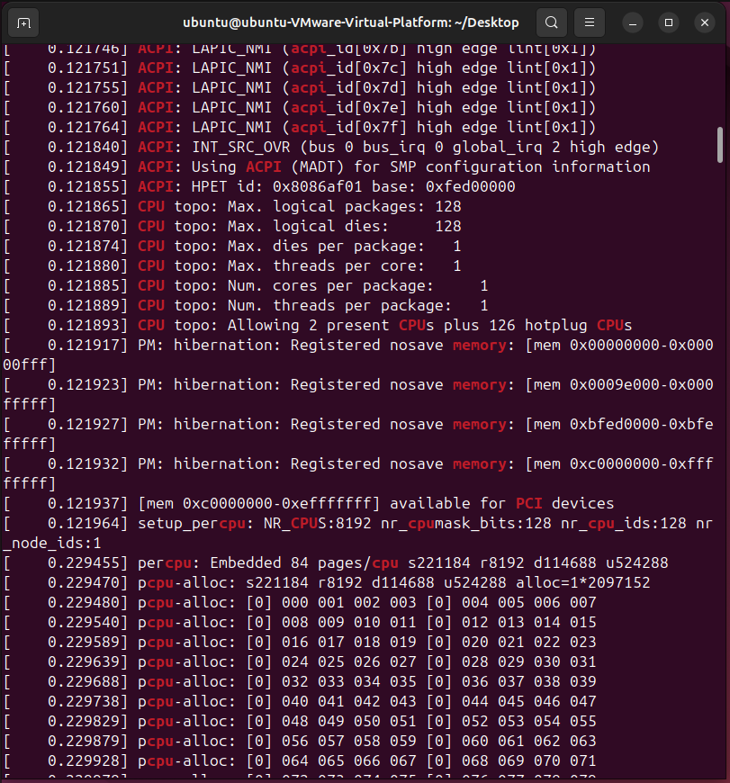

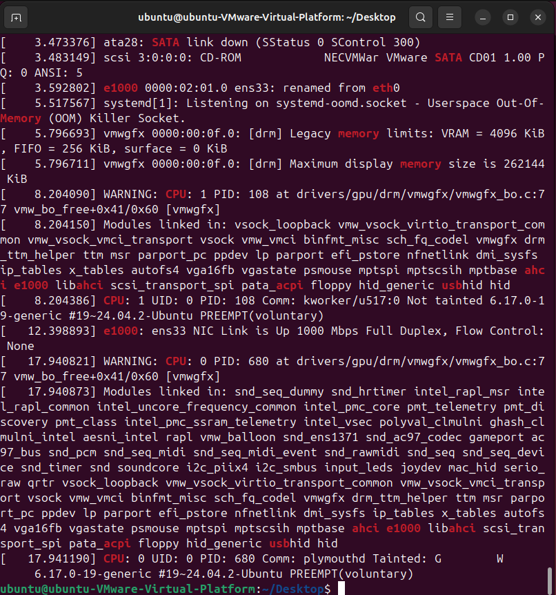

## Section 12 - Kesehatan Storage dan Kemampuan Khusus Perangkat

Berdasarkan output `lsblk -d -o NAME,MODEL,SIZE,ROTA,TYPE`, perangkat penyimpanan utama pada sistem ini adalah **`/dev/sda`** dengan model **`VMware Virtual S`** dan kapasitas **25G**. Nilai `ROTA` untuk perangkat ini adalah **1**, yang berarti dari sudut pandang `lsblk` perangkat tersebut dipresentasikan sebagai **rotational device**. Selain itu, terdapat perangkat `sr0` dan `sr1` yang terdeteksi sebagai **VMware Virtual SATA CDRW Drive**, tetapi keduanya merupakan perangkat optik virtual, bukan media penyimpanan utama sistem.

Pemeriksaan dengan `sudo smartctl -a /dev/sda` memberikan informasi tambahan bahwa perangkat ini memiliki vendor **VMware**, produk **VMware Virtual S**, ukuran logis sekitar **26.8 GB**, serta `Rotation Rate: Solid State Device`. Namun pada bagian kesehatan SMART, `smartctl` secara eksplisit menampilkan **`SMART support is: Unavailable - device lacks SMART capability`**. Temperatur yang terbaca adalah **0 C**, dan log juga menyebutkan bahwa perangkat **tidak mendukung self-test logging**. Hasil ini menunjukkan bahwa command berhasil dijalankan, tetapi guest Linux tidak menerima telemetri SMART yang benar-benar lengkap dari media penyimpanan fisik host.

Dari sisi jenis teknologi dan controller, output `lspci -nnk` menunjukkan adanya **VMware SATA AHCI controller** pada perangkat PCI **`02:04.0`** dengan driver kernel **`ahci`**. Selain itu juga terlihat **Intel 82371AB/EB/MB PIIX4 IDE** dengan driver **`ata_piix`**, yang merupakan bagian dari emulasi chipset virtual. Keterkaitan ini menunjukkan bahwa disk utama guest Linux terhubung melalui lapisan controller virtual yang diekspos oleh VMware, bukan langsung ke perangkat storage fisik host.

Secara praktis, snapshot kesehatan storage pada sistem ini dapat diringkas sebagai berikut: Linux berhasil mengidentifikasi disk utama, kapasitasnya, dan controller yang digunakan, serta memperoleh sebagian informasi dari `smartctl`. Akan tetapi, informasi kesehatan mendalam masih terbatas karena perangkat virtual ini **tidak memiliki SMART capability** dari sudut pandang guest. Di samping itu, terdapat ketidaksesuaian kecil antara `lsblk` yang menampilkan `ROTA=1` dan `smartctl` yang menampilkan `Rotation Rate: Solid State Device`, yang sangat mungkin merupakan efek representasi perangkat virtual oleh VMware.

### Ringkasan Storage Health

| Komponen | Informasi |
| --- | --- |
| Perangkat utama | `/dev/sda` |
| Model | `VMware Virtual S` |
| Kapasitas | 25G |
| Jenis block device | `disk` |
| ROTA | `1` pada `lsblk`, tetapi `smartctl` menyebut `Solid State Device` |
| Ringkasan health SMART | `Unavailable - device lacks SMART capability` |
| Temperatur / warning | `Current Drive Temperature: 0 C`; tidak ada self-test logging |
| Controller terkait | VMware SATA AHCI controller |
| Driver controller | `ahci` |

### Kesimpulan Section 12

Section 12 menunjukkan bahwa Linux dapat mengidentifikasi jenis dan jalur teknologi storage, lalu menambah konteks kesehatan perangkat melalui `smartctl`. Pada sistem ini, disk utama terlihat sebagai **VMware Virtual S 25G** yang terhubung melalui **VMware SATA AHCI controller** dengan driver **`ahci`**. Meskipun `smartctl` dapat dijalankan, perangkat virtual ini dilaporkan **tidak memiliki SMART capability**, sehingga informasi health tetap terbatas. Ini merupakan kondisi yang masuk akal pada lingkungan VMware, karena guest tidak selalu menerima seluruh telemetri kesehatan dari perangkat storage fisik host.

### Bukti Screenshot

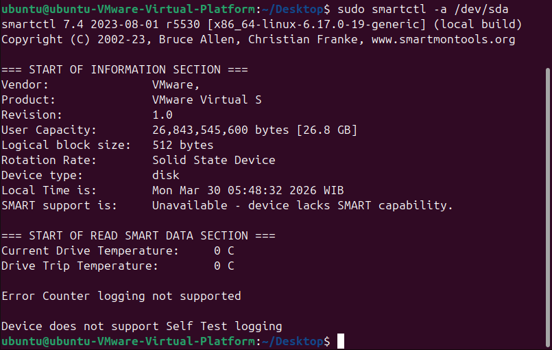

## Section 13 - Laporan Validasi Hardware Lintas Tools

Section 13 menyatukan hasil pengamatan dari berbagai command untuk memvalidasi informasi perangkat keras secara lintas lapisan. Pendekatan ini penting karena Linux tidak memperoleh semua informasi dari satu sumber saja. Sebagian data berasal dari firmware seperti DMI/SMBIOS, sebagian berasal dari kernel yang melihat perangkat saat runtime, sebagian lagi berasal dari enumerasi bus seperti PCI, dan sebagian lain berasal dari abstraksi sistem operasi seperti interface jaringan atau mount point. Dengan melakukan validasi silang, laporan perangkat keras menjadi lebih kuat dan tidak hanya bergantung pada satu output.

### Tabel Validasi Lintas Tools

| Kategori | Ringkasan Hasil | Bukti / Command Utama |
| --- | --- | --- |
| Identitas sistem | Vendor `VMware, Inc.`, model `VMware Virtual Platform`, BIOS `Phoenix Technologies LTD` versi `6.00`, mesin virtual | `dmidecode -t system -t bios`, `uname -m`, `uname -r` |
| Topologi CPU | `2` logical CPU, `2` socket, `1` core per socket, `1` thread per core | `lscpu`, `nproc`, `grep -c ^processor /proc/cpuinfo`, `/proc/cpuinfo` |
| Flag CPU | `aes`, `sse4_1`, `sse4_2`, `avx`, `avx2`, `hypervisor`; `vmx/svm` tidak terlihat | `lscpu`, `grep '^flags' /proc/cpuinfo` |
| Hirarki cache | L1d `48 KiB`, L1i `32 KiB`, L2 `1.3 MiB`, L3 `24 MiB` per instance | `lscpu -C`, `/sys/devices/system/cpu/cpu0/cache/index*` |
| Memori fisik | 1 modul `4 GB` pada `RAM slot #0`, banyak slot kosong, speed `Unknown` | `dmidecode -t memory`, `dmesg` (`DMI: Memory slots populated: 1/128`) |
| Memori runtime | Total `3.8 GiB`, available `2.5 GiB`, kondisi memori masih longgar | `free -h`, `free -h -w`, `/proc/meminfo`, `vmstat 1 5` |
| Swap | Swap `3.8 GiB`, tidak terpakai, tidak ada swap-in/swap-out | `free -h -w`, `/proc/meminfo`, `vmstat 1 5` |
| Peta storage | Disk utama `/dev/sda`, root filesystem pada `/dev/sda2`, tipe `ext4`, mount point `/` | `lsblk`, `findmnt /`, `df -hT /` |
| Perangkat PCI | Terdeteksi VGA, NIC, audio, USB controller, SATA controller, dan VMCI | `lspci -nnk` |
| USB devices | Root hub Linux dan perangkat virtual VMware USB terdeteksi | `lsusb`, validasi silang dengan `lspci -nnk` |
| Network hardware | NIC `ens33`, MAC `00:0c:29:ad:38:25`, IP `192.168.5.128`, driver `e1000`, link `1 Gbit/s full duplex` | `ip addr`, `ethtool`, `ethtool -i`, `lshw -class network`, `lspci -nnk` |
| Kernel-detected events | Kernel mencatat inisialisasi CPU, DMI memori, tabel ACPI, reservasi memori firmware | `dmesg`, validasi silang dengan `dmidecode`, `lspci`, `free` |

### Contoh Validasi Silang Antar Command

1. **Topologi CPU**  
   `lscpu` memberikan ringkasan terstruktur tentang jumlah socket, core, dan thread. Informasi ini kemudian divalidasi oleh `nproc` dan `grep -c ^processor /proc/cpuinfo`, yang sama-sama menunjukkan bahwa Linux benar-benar melihat **2 CPU logis**. Dengan demikian, ringkasan topologi dan detail per-processor saling menguatkan.

2. **Memori fisik vs memori runtime**  
   `dmidecode -t memory` menunjukkan bahwa firmware memaparkan **1 modul RAM 4 GB**, sedangkan `free -h` dan `/proc/meminfo` menunjukkan bahwa kernel hanya melihat sekitar **3.8 GiB** memori total. Kedua output ini tidak saling bertentangan, tetapi justru memberi konteks bahwa inventaris firmware dan memori usable runtime adalah dua sudut pandang yang berbeda.

3. **NIC di PCI vs interface jaringan**  
   `lspci -nnk` menunjukkan adanya **Intel 82545EM Gigabit Ethernet Controller** dengan driver **`e1000`**. Informasi itu kemudian diperkaya oleh `ethtool`, `ethtool -i`, dan `lshw -class network`, yang menunjukkan bahwa perangkat tersebut di level OS muncul sebagai interface **`ens33`** dengan link aktif **1 Gbit/s full duplex**. Jadi satu perangkat yang sama tervalidasi pada level PCI dan level interface jaringan.

4. **Storage map**  
   `lsblk` menunjukkan struktur disk dan partisi, tetapi belum menjelaskan mount point pengguna. `findmnt /` dan `df -hT /` menambahkan konteks bahwa partisi **`/dev/sda2`** dengan filesystem **ext4** dimount sebagai **`/`**, sehingga hubungan antara block device dan direktori sistem menjadi jelas.

### Ambiguitas, Ketidaksesuaian, dan Field yang Hilang

1. **Jumlah slot memori yang sangat besar**  
   Firmware virtual menampilkan **128 slot memori** dengan hanya **1 slot terisi**. Ini tidak mencerminkan motherboard fisik yang realistis, tetapi merupakan efek umum dari virtualisasi dan cara VMware memaparkan tabel DMI ke guest.

2. **Flag virtualisasi `vmx/svm` tidak terlihat di guest**  
   CPU model yang muncul adalah Intel modern, tetapi flag `vmx` tidak terlihat pada guest Linux. Hal ini paling mungkin terjadi karena hypervisor tidak mengekspos nested virtualization ke sistem tamu, bukan karena host benar-benar tidak mendukung virtualisasi.

3. **Atribut storage tidak sepenuhnya konsisten**  
   `lsblk` menampilkan `ROTA=1`, tetapi `smartctl` menyebut `Rotation Rate: Solid State Device`. Perbedaan ini kemungkinan berasal dari cara VMware mempresentasikan disk virtual ke guest, sehingga atribut teknologi storage tidak selalu identik antar tool.

4. **Informasi SMART tetap terbatas meskipun `smartctl` berhasil dijalankan**  
   `smartctl` dapat membaca identitas perangkat virtual, tetapi hasilnya tetap menyatakan `SMART support is: Unavailable - device lacks SMART capability`. Artinya, guest hanya menerima informasi parsial dan bukan telemetry kesehatan fisik penuh dari host.

### Kesimpulan Section 13

Validasi lintas tools menunjukkan bahwa informasi perangkat keras di Linux paling akurat bila dibangun dari beberapa sumber sekaligus, bukan dari satu command saja. `dmidecode` menjelaskan apa yang dipaparkan firmware, `lscpu` dan `/proc/cpuinfo` menjelaskan bagaimana CPU terlihat oleh kernel, `free` dan `/proc/meminfo` menggambarkan kondisi runtime memori, `lsblk` serta `findmnt` memetakan storage ke filesystem, `lspci` mengungkap perangkat internal pada bus PCI, `ethtool` menjelaskan keadaan nyata NIC, dan `dmesg` memperlihatkan urutan deteksi hardware saat boot. Laporan ini juga menunjukkan bahwa pada lingkungan virtual, beberapa field dapat tampak generik, tidak lengkap, atau disederhanakan, sehingga interpretasi yang baik harus selalu mempertimbangkan konteks virtualisasi.

### Bukti Screenshot

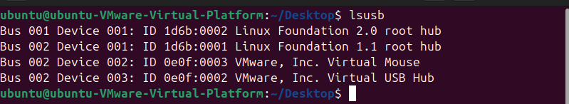

## Penutup

Berdasarkan seluruh pengamatan, sistem Linux yang dianalisis berjalan pada lingkungan virtual VMware dengan konfigurasi perangkat keras virtual yang berhasil dikenali Linux melalui berbagai lapisan, mulai dari firmware, kernel, bus PCI, interface jaringan, hingga filesystem. Seluruh section pada praktikum ini menunjukkan bahwa analisis perangkat keras di Linux tidak cukup dilakukan dengan satu command, tetapi perlu divalidasi dengan beberapa tool agar kesimpulan yang diambil lebih akurat.

Secara umum, sistem yang diamati berada dalam kondisi normal dari sisi CPU, memori, storage, jaringan, dan proses inisialisasi kernel. Beberapa informasi terlihat generik atau terbatas karena sifat virtualisasi, tetapi justru hal ini menjadi bagian penting dari pembelajaran bahwa Linux hanya dapat melihat apa yang dipaparkan oleh firmware dan hypervisor kepada sistem tamu.
