# Analisis Quiz-Test

Folder `Quiz-Test` berisi `20` screenshot soal kuis yang membahas topik:

- blocking dan fragmentasi record
- alokasi file
- indexed allocation dan B-tree
- operasi dasar file system
- organisasi file
- hak akses, directory information, dan file sharing

Catatan:

- Semua gambar di bawah ditampilkan lebih kecil memakai tag HTML `img` supaya preview Markdown tidak terlalu besar.
- Untuk beberapa soal bertipe `pilih semua jawaban yang benar`, teks opsi pada screenshot terlihat sedikit menyatu. Karena itu, penjelasan di bawah fokus pada konsep dan jawaban intinya.

## 1. Fixed-Length Blocking

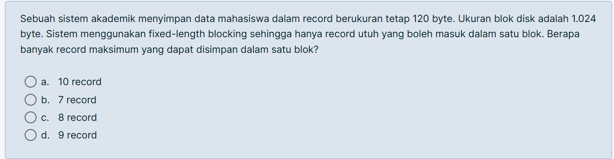

Jawaban: `c. 8 record`

Penjelasan: ukuran blok `1024 byte` dan ukuran record `120 byte`, jadi jumlah record maksimum adalah `floor(1024 / 120) = 8`.

## 2. Internal Fragmentation

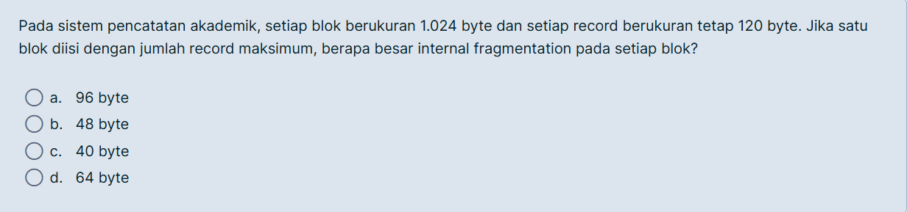

Jawaban: `d. 64 byte`

Penjelasan: jika 1 blok diisi `8` record, ruang terpakai `8 x 120 = 960 byte`. Sisa ruang dalam blok adalah `1024 - 960 = 64 byte`, itulah internal fragmentation.

## 3. Sequential File dengan 2.500 Record

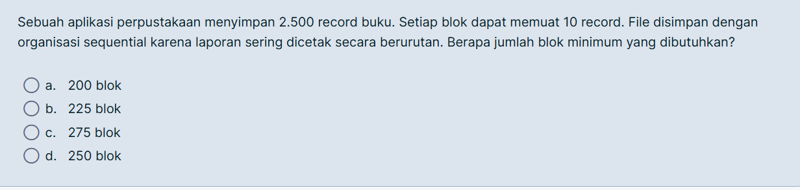

Jawaban: `d. 250 blok`

Penjelasan: setiap blok memuat `10` record, jadi kebutuhan blok minimum adalah `2500 / 10 = 250`.

## 4. Variable-Length Unspanned Blocking

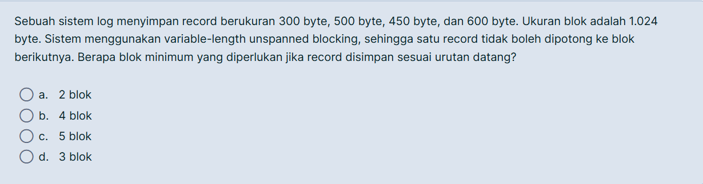

Jawaban: `d. 3 blok`

Penjelasan: record disimpan sesuai urutan datang dan tidak boleh dipotong ke blok berikutnya. Susunannya menjadi:

- Blok 1: `300 + 500 = 800`
- Blok 2: `450`
- Blok 3: `600`

Jadi minimum perlu `3` blok.

## 5. Variable-Length Spanned Blocking

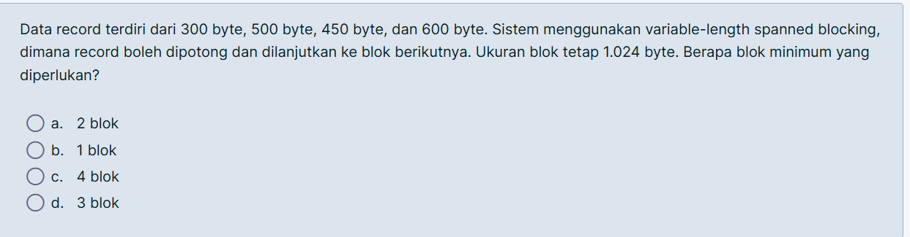

Jawaban: `a. 2 blok`

Penjelasan: total ukuran data adalah `300 + 500 + 450 + 600 = 1850 byte`. Karena record boleh dipotong, cukup butuh `ceil(1850 / 1024) = 2` blok.

## 6. Contiguous Allocation

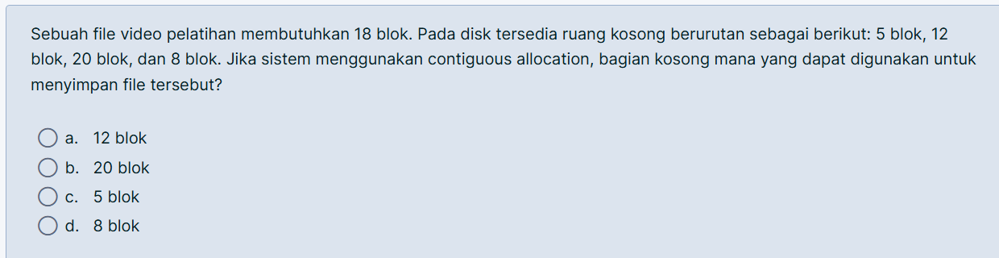

Jawaban: `b. 20 blok`

Penjelasan: file butuh `18` blok berurutan, jadi hanya ruang kosong berukuran minimal `18` yang bisa dipakai. Dari pilihan `5`, `12`, `20`, dan `8`, hanya `20 blok` yang cukup.

## 7. Chained Allocation

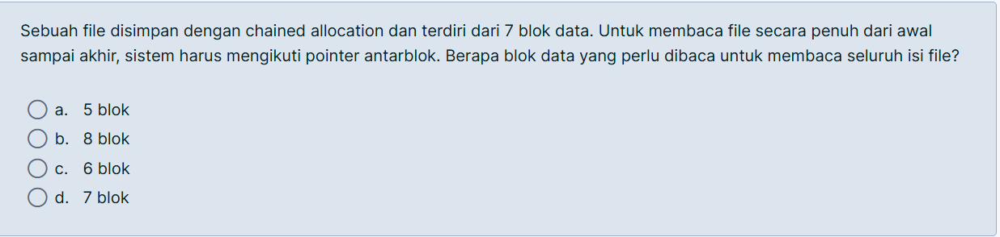

Jawaban: `d. 7 blok`

Penjelasan: file terdiri dari `7` blok data. Untuk membaca seluruh isi file dari awal sampai akhir, sistem tetap harus membaca semua `7` blok data sambil mengikuti pointer antarblok.

## 8. Indexed Allocation

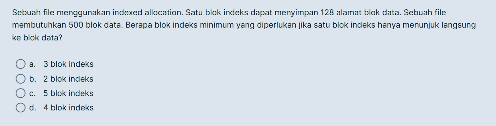

Jawaban: `d. 4 blok indeks`

Penjelasan: satu blok indeks menampung `128` alamat blok data. Untuk `500` blok data dibutuhkan `ceil(500 / 128) = 4` blok indeks.

## 9. B-Tree: Jumlah Maksimum Key

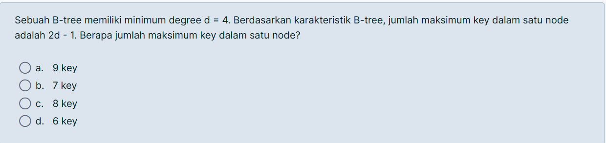

Jawaban: `b. 7 key`

Penjelasan: untuk B-tree dengan minimum degree `d = 4`, jumlah maksimum key pada satu node adalah `2d - 1 = 2(4) - 1 = 7`.

## 10. B-Tree: Jumlah Minimum Key

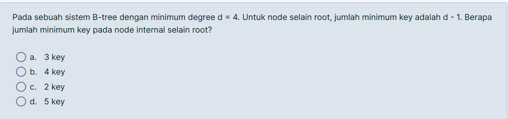

Jawaban: `a. 3 key`

Penjelasan: untuk node internal selain root, jumlah minimum key adalah `d - 1`. Dengan `d = 4`, hasilnya `3`.

## 11. Urutan Operasi File System

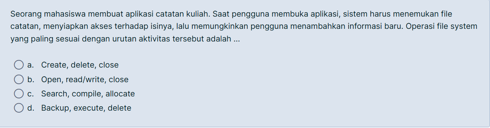

Jawaban: `b. Open, read/write, close`

Penjelasan: aplikasi harus membuka file dulu, lalu membaca atau menulis isi file, dan terakhir menutup file setelah selesai.

## 12. Kebutuhan Minimal Pengguna pada File System

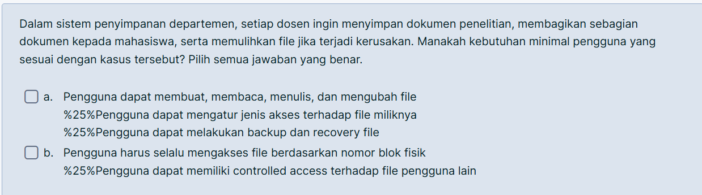

Jawaban inti:

- pengguna bisa membuat, membaca, menulis, dan mengubah file
- pengguna bisa mengatur hak akses atau controlled access
- pengguna bisa melakukan backup dan recovery

Penjelasan: kasusnya menuntut penyimpanan dokumen, berbagi ke mahasiswa, dan pemulihan file saat rusak. Karena itu kebutuhan penting adalah operasi file dasar, pengaturan akses, serta backup dan recovery. Mengakses file lewat nomor blok fisik bukan kebutuhan minimal pengguna biasa.

## 13. Organisasi File untuk Data IoT

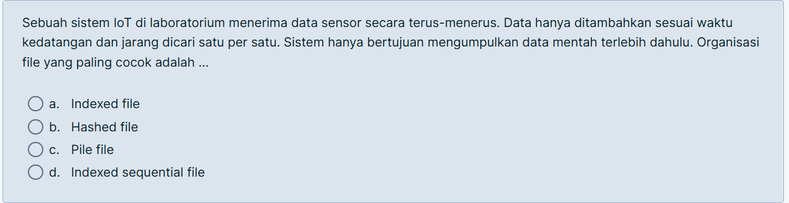

Jawaban: `c. Pile file`

Penjelasan: data sensor terus ditambahkan sesuai urutan kedatangan dan jarang dicari satu per satu. Model paling cocok adalah `pile file` karena fokusnya pada append sederhana.

## 14. Organisasi File untuk Data Mahasiswa Berurutan

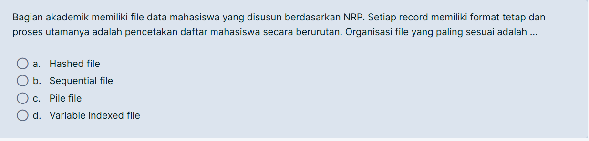

Jawaban: `b. Sequential file`

Penjelasan: data mahasiswa disusun berdasarkan `NRP`, format record tetap, dan kebutuhan utama adalah pencetakan urut. Itu cocok dengan `sequential file`.

## 15. Organisasi File untuk Bank

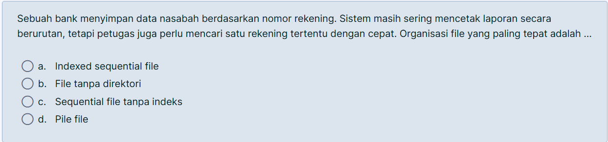

Jawaban: `a. Indexed sequential file`

Penjelasan: sistem butuh dua hal sekaligus: laporan berurutan dan pencarian cepat untuk satu rekening tertentu. `Indexed sequential file` menggabungkan akses sekuensial dan bantuan indeks.

## 16. Hak Akses pada File Log

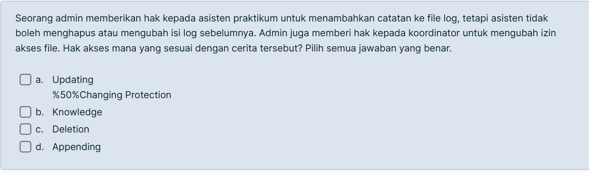

Jawaban inti:

- `Appending` untuk asisten praktikum
- `Changing protection` untuk koordinator

Penjelasan: asisten hanya boleh menambahkan catatan baru tanpa mengubah isi lama, jadi haknya adalah `append`. Koordinator boleh mengubah izin akses, jadi butuh `changing protection`.

## 17. Elemen Informasi Direktori

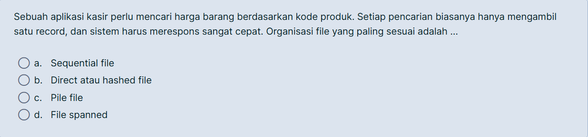

Jawaban inti:

- `Basic information`
- `Address information`
- `Access control information`
- `Usage information`

Penjelasan:

- nama file, ukuran, dan waktu pembuatan/perubahan termasuk informasi dasar atau penggunaan
- lokasi blok penyimpanan termasuk `address information`
- pemilik dan hak akses termasuk `access control information`

`CPU scheduling information` jelas tidak terkait dengan entri direktori file.

## 18. Kebijakan Alokasi yang Lebih Sesuai

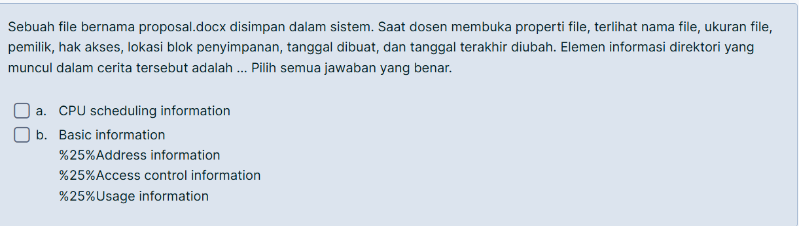

Jawaban: `d. Dynamic allocation`

Penjelasan: ukuran akhir file belum bisa dipastikan sejak awal. Karena itu alokasi yang tumbuh sesuai kebutuhan lebih efisien dibanding `pre-allocation` yang berisiko membuang ruang disk.

## 19. Isu Utama File Sharing

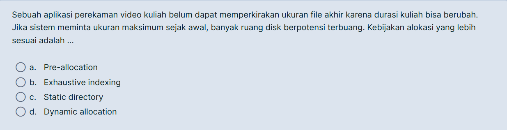

Jawaban inti:

- `Access rights`
- `Management of simultaneous access`
- `User access control`

Penjelasan: kasus ini menyoroti dua masalah besar, yaitu bentrok saat file diedit bersamaan dan pembatasan siapa yang boleh membaca, menulis, atau menghapus. Jadi fokusnya adalah kontrol akses dan pengelolaan akses serentak, bukan record blocking atau CPU register allocation.

## 20. Organisasi File untuk Pencarian Harga Barang

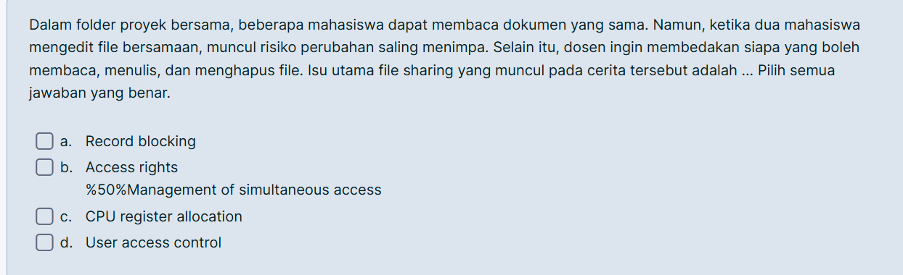

Jawaban: `b. Direct atau hashed file`

Penjelasan: aplikasi kasir biasanya melakukan pencarian cepat untuk satu record berdasarkan kode produk. `Direct/hashed file` cocok karena dirancang untuk lookup cepat berdasarkan key.

## Ringkasan Konsep

Dari seluruh screenshot, materi yang paling dominan adalah:

- `blocking`: fixed-length, unspanned, spanned, dan fragmentasi internal
- `allocation`: contiguous, chained, indexed, pre-allocation, dynamic allocation
- `organization`: pile, sequential, indexed sequential, direct/hashed
- `file system`: operasi file, hak akses, struktur direktori, dan file sharing
- `index structure`: konsep dasar `B-tree`
